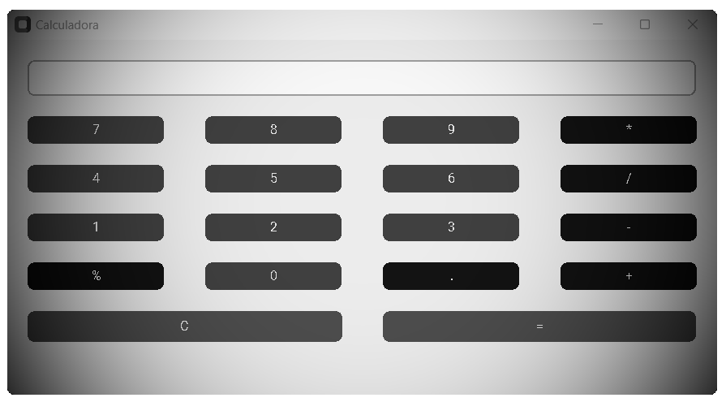
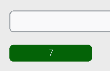
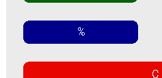
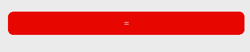

# Calculadora Python



## Passo a Passo

### 1. Importações e Configurações Iniciais

````Python
import customtkinter as calc
import re
````

* customtkinter: Uma biblioteca baseada no tkinter, mas com mais recursos visuais modernos. Usamos ela para criar a interface gráfica (GUI) da calculadora.
* *re: Módulo de expressões regulares, usado para manipular a entrada de texto da calculadora e tratar o símbolo de porcentagem.

### 2. Configuração do Tema e Criação da Janela

````Python
calc.set_appearance_mode('light')
app = calc.CTk()
app.title("Calculadora")
app.geometry("700x350")
app.maxsize(700, 350)
app.grid_columnconfigure((0, 1, 2, 3), weight=1)

````

* calc.set_appearance_mode('light'): Define o tema claro para a interface da calculadora.
* app = calc.CTk(): Cria a janela principal da aplicação.
* app.title(): Define o título da janela.
* app.geometry(): Define o tamanho da janela.
* app.maxsize(): Limita o redimensionamento da janela a 700x350 pixels.
* app.grid_columnconfigure(): Configura as colunas para que o conteúdo seja distribuído proporcionalmente, o que garante que a interface fique bem alinhada.

### 3. Variável Global para Armazenar a Expressão

````Python
expressao = ""
````

* Esta variável guarda a expressão matemática que o usuário insere, como 100+80%.

### 4. Função para Atualizar a Entrada de Texto

````Python
def adicionar_valor(valor):
    global expressao
    expressao += str(valor)
    numero.delete(0, calc.END)
    numero.insert(calc.END, expressao)
````

* adicionar_valor(valor): Recebe o valor do botão clicado (um número ou operador).
* expressao += str(valor): O valor clicado é adicionado à expressão.
* numero.delete(0, calc.END): Limpa o campo de texto.
* numero.insert(calc.END, expressao): Atualiza o campo de texto com a nova expressão.

### 5. Função de Cálculo da Expressão

````Python
def calcular():
    global expressao
    try:
        expressao_modificada = re.sub(r'(\d+(\.\d+)?)(\s*\+\s*)(\d+(\.\d+)?)(%)', 
                                       lambda m: f'{m.group(1)} + ({m.group(4)} / 100) * {m.group(1)}', 
                                       expressao)
        expressao_modificada = re.sub(r'(\d+(\.\d+)?)(\s*-\s*)(\d+(\.\d+)?)(%)', 
                                       lambda m: f'{m.group(1)} - ({m.group(4)} / 100) * {m.group(1)}', 
                                       expressao_modificada)
        resultado = str(eval(expressao_modificada))
        numero.delete(0, calc.END)
        numero.insert(calc.END, resultado)
        expressao = resultado
    except Exception as e:
        numero.delete(0, calc.END)
        numero.insert(calc.END, "Erro")
        expressao = ""
````

* calcular(): Processa a expressão inserida.
* expressao_modificada: Usa uma expressão regular para encontrar números seguidos de % e substitui por uma fração que representa a porcentagem. Exemplo: 80% é transformado em (80/100)*100.
* eval(): Avalia e executa a expressão matemática. Ele lida com operações como somar, subtrair, multiplicar, dividir e porcentagens.
* try/except: Tenta calcular a expressão e, se houver algum erro (como dividir por zero), exibe "Erro" no campo de texto.

### 6. Função para Limpar a Entrada

````Python
def limpar():
    global expressao
    expressao = ""
    numero.delete(0, calc.END)
````

* limpar(): Reseta a expressão e limpa o campo de texto, permitindo que o usuário comece de novo.

### 7. Criação da Caixa de Entrada

````Python
numero = calc.CTkEntry(app, placeholder_text="", font=("Arial", 24), justify="right")
numero.grid(row=0, column=0, padx=20, pady=20, sticky="ew", columnspan=4)
````

* numero: Campo de entrada de texto onde a expressão e o resultado são exibidos.
* font=("Arial", 24): Define a fonte e o tamanho do texto na entrada.
* justify="right": Alinha o texto à direita, como em uma calculadora comum.

### 8. Criação dos Botões de Números e Operações

> Cada botão é criado com um comando associado. Aqui estão alguns exemplos:

#### Botão "7":

````Python
button7 = calc.CTkButton(app, text="7", fg_color='#046307', hover_color='#5c9f59', command=lambda: adicionar_valor(7))
button7.grid(row=2, column=0, padx=20, pady=(0, 20), sticky="w")
````

* calc.CTkButton(): Cria um botão com o texto "7".
* fg_color e hover_color: Definem a cor do botão e a cor ao passar o mouse sobre ele.
* command=lambda: adicionar_valor(7): Define a ação de adicionar o valor 7 à expressão quando o botão é clicado.


  
#### Botão de Porcentagem "%":

````Python
buttonP = calc.CTkButton(app, text="%", fg_color='#00008b', hover_color='#000', command=lambda: adicionar_valor("%"))
buttonP.grid(row=5, column=0, padx=20, pady=(0, 20), sticky="ew", columnspan=1)
````

* Funciona da mesma forma que os outros botões, mas adiciona o símbolo % à expressão, o qual é tratado na função calcular().



#### Botão de Igual "=":

````Python
buttonEqual = calc.CTkButton(app, text="=", fg_color='#e80700', hover_color='#831106', command=calcular, height=30)
buttonEqual.grid(row=6, column=2, padx=20, pady=0, sticky="ew", columnspan=2)
````

* command=calcular: Quando o botão de igual é clicado, a função calcular() é chamada, processando a expressão e exibindo o resultado.



#### Botão de Limpar "C":

````Python
buttonClear = calc.CTkButton(app, text="C", fg_color='#e80700', hover_color='#831106', command=limpar, height=30)
buttonClear.grid(row=6, column=0, padx=20, pady=0, sticky="ew", columnspan=2)
````

* command=limpar: Limpa a entrada quando o botão é clicado.


### 9. Execução do Loop da Aplicação

````Python
app.mainloop()
````

* app.mainloop(): Mantém a aplicação rodando e esperando interações do usuário.

## Resumo

1. O usuário clica em botões numéricos e de operações (e.g., 7, +, %).
2. Cada clique adiciona o valor à expressão.
3. O usuário pode clicar em = para calcular a expressão, que é processada e exibida.
4. O botão % é tratado de maneira especial para calcular porcentagens corretamente.
5. O botão C limpa a entrada, permitindo recomeçar.

